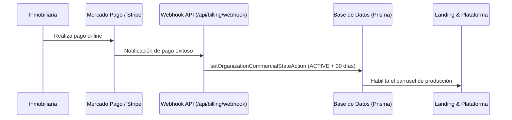

# Manual Operativo — RaicesPilot SaaS

**Versión**: 3.1  
**Fecha**: Mayo 2026  
**Documento**: Guía centralizada de operación técnica y comercial para Superadmins y Operadores.

> [!IMPORTANT]
> **AgentOS 3.1 (Governance & Production Safety)** está actualmente habilitado **exclusivamente** para el panel de Superadmin. El Panel de Administrador Inmobiliario (Tenants) mantiene su versión operativa estándar hasta nuevo aviso.

---

## 1. Visión del Producto y Arquitectura

**RaicesPilot** es una plataforma SaaS multi-tenant diseñada para automatizar el ciclo de vida del lead inmobiliario en Argentina.

### 1.1. Estructura de Paneles
1. **Landing Pública**: Vitrina comercial y captación central vía WhatsApp oficial.
2. **Panel Admin Inmobiliario (Tenant)**: Gestión diaria de la inmobiliaria (leads, propiedades, visitas).
3. **Panel Superadmin (Platform)**: Control global, métricas, salud del sistema y AgentOS.
4. **AgentOS 3.1**: Sistema avanzado de operaciones asistidas por agentes IA (solo Superadmin).

### 1.2. Separación de Responsabilidades (PLATFORM vs ORGANIZATION)
- **PLATFORM**: Nivel infraestructura. Controla suscripciones, salud global y gobernanza de agentes.
- **ORGANIZATION**: Nivel cliente. Controla sus propios datos, equipo y agentes locales.

---

## 2. Panel de Administrador Inmobiliario (Tenant)

Ubicado en `/[orgSlug]`, permite a la inmobiliaria gestionar su negocio:

- **Inicio/Captación**: Vista rápida de actividad y links de referido.
- **Prospectos & Conversaciones**: CRM de leads y chat multicanal asistido por IA.
- **Visitas**: Calendario de citas coordinadas por la IA.
- **Propiedades**: Inventario sincronizado o cargado manualmente.
- **Agentes IA**: Configuración local (tono, filtros de presupuesto, zonas).
- **Equipo & Organización**: Gestión de miembros y roles (OWNER, ADMIN, AGENT).
- **Integraciones**: Vinculación de WhatsApp Business (WABA).

---

## 3. AgentOS 3.1 (Superadmin Center)

Ubicado en `/platform/agents`, es el núcleo de inteligencia y gobernanza de RaicesPilot.

### 3.1. Gestión Operativa
- **Objetivos Operativos**: Definición de metas de alto nivel (ej. "Generar contenido para Mayo").
- **Director Operativo IA**: Agente orquestador que desglosa objetivos en tareas.
- **Biblioteca de Agentes**: Repositorio de perfiles especializados (Marketing, Análisis, etc.).
- **Canvas & Tareas**: Espacio visual para el seguimiento de ejecuciones y runs.
- **Borradores & Aprobaciones**: Flujo Human-in-the-loop antes de cualquier publicación o acción externa.

### 3.2. Automatización y Calendario
- **Automatizaciones Controladas**: Reglas internas que disparan tareas programadas.
- **Calendario Interno**: Vista unificada de publicaciones proyectadas y tareas futuras.
- **Scheduler Interno Seguro**: Motor de ejecución de tareas diferidas protegido por secreto.

### 3.3. Integración con Meta (Safe Mode)
- **Meta Read-Only**: Sincronización y monitoreo de páginas sin permiso de escritura por defecto.
- **Publicación Manual Asistida**: Flujo de publicación directa a Facebook/Instagram tras aprobación.
- **Publicación Programada**: Ejecución automática de posts aprobados (bajo flag de seguridad).

### 3.4. Gobernanza y Seguridad (RC 3.1)
- **Budget Guard**: Límites de ejecución y autonomía para agentes IA, previniendo costos inesperados.
- **Org Chart**: Visualización jerárquica de la estructura de agentes activos.
- **Feature Flag Center**: Activación dinámica de capacidades (Meta, Publishing, Scheduled).
- **Readiness Center**: Auditoría técnica antes de habilitar nuevas funciones en producción.
- **Audit Export**: Generación de reportes operativos para auditoría externa.

---

## 4. Seguridad y Protocolos Técnicos

### 4.1. Protección de Acceso
- **requirePlatformAdmin**: Todas las rutas de AgentOS 3.1 requieren permisos de administrador de plataforma.
- **HMAC-SHA256**: Validación de sesiones en cada request.
- **Cifrado de Tokens**: Los tokens de Meta y WhatsApp nunca son visibles en la UI y se almacenan cifrados (AES-256).

### 4.2. Infraestructura de Producción
- **Cron Jobs**: Protegidos por `AGENTOS_CRON_SECRET`. Solo el programador autorizado puede disparar ejecuciones.
- **Feature Flags**: Las funciones de publicación están desactivadas por defecto (`false`) y solo se activan mediante variables de entorno tras QA exitoso.

---

## 5. Guía de Despliegue Seguro (Railway)

Para garantizar la estabilidad del sistema, se deben seguir estrictamente estos pasos:

### 5.1. Reglas de Base de Datos
- **PROHIBIDO**: No usar `npx prisma db push` en producción.
- **PROHIBIDO**: No usar `npx prisma migrate reset` en producción (pérdida de datos).
- **OBLIGATORIO**: Usar siempre `npx prisma migrate deploy --schema prisma/schema.prisma`.

### 5.2. Checklist Pre-Deploy
1. Ejecutar `npx prisma validate`.
2. Ejecutar `npx prisma generate`.
3. Validar tipos con `npx tsc --noEmit`.
4. Realizar `npx next build`.
5. Verificar el **Readiness Center** tras el despliegue para confirmar variables críticas.

### 5.3. Variables de Entorno Críticas
- `AGENTOS_CRON_SECRET`: Secreto para ejecuciones programadas.
- `WHATSAPP_TOKEN_ENCRYPTION_KEY`: Llave de cifrado simétrico.
- `AGENTOS_ENABLE_META_PUBLISHING`: Mantener en `false` hasta validación final.
- `AGENTOS_ENABLE_SCHEDULED_PUBLISHING`: Mantener en `false` hasta validación final.

---

## 6. Soporte y Mantenimiento
El sistema mantiene logs de auditoría inmutables para cada acción administrativa. En caso de error crítico, el **Readiness Center** marcará en rojo las piezas de infraestructura fallidas.

---

## 7. Control Comercial y Suscripciones (Manual vs Automático)

El sistema de facturación y suscripciones de RaicesPilot opera bajo un modelo híbrido que permite tanto la automatización total de cobros online como la intervención manual directa del Superadmin para excepciones comerciales y transferencias bancarias.

### 7.1. Flujo Manual (Control Comercial - Modal en Superadmin)
Ubicado en el panel Superadmin en la pestaña de **Clientes** (`/platform/organizations`), al hacer clic en **Comercial** se abre el modal de **Control Comercial**. Este control manual tiene prioridad sobre las restricciones por defecto y actualiza directamente la base de datos.

#### Presets de Acción Rápida:
1. **Activar 30d**: 
   - **Estado final**: `ACTIVE`
   - **Modo de cobro**: `TRANSFER` (Transferencia)
   - **Vencimiento (`currentPeriodEnd`)**: Fecha actual + 30 días.
   - **Impacto**: Activa inmediatamente la inmobiliaria (`isActive: true` en base de datos) y registra el método para el control del dashboard.
2. **Trial 14d**: 
   - **Estado final**: `TRIALING`
   - **Modo de cobro**: `MANUAL`
   - **Vencimiento (`currentPeriodEnd`)**: Fecha actual + 14 días.
   - **Impacto**: Habilita la inmobiliaria para pruebas técnicas sin requerir datos de facturación ni aparecer en el carrusel comercial de producción.
3. **Suspender**: 
   - **Estado final**: `SUSPENDED`
   - **Impacto**: Revoca inmediatamente el acceso al panel del tenant. Se detienen los bots de chat de WhatsApp asociados a esta organización y se bloquea el uso de AgentOS.

#### Campos de Configuración Manual:
* **Plan**: Selección del nivel de servicio asignado (`Plan Enterprise`, `Plan Starter`, etc.).
* **Estado**: `TRIALING` (Trial), `ACTIVE` (Activa), `PAST_DUE` (Pago pendiente), `CANCELLED` (Cancelada), `SUSPENDED` (Suspendida).
* **Modo de cobro**: 
  - `ONLINE` (Stripe/Mercado Pago automatizado).
  - `CASH` (Efectivo manual).
  - `TRANSFER` (Transferencia bancaria).
  - `COURTESY` (Cortesía sin cargo).
  - `MANUAL` (Control manual genérico).
* **Vence el**: Fecha exacta de finalización del período de cobro.
* **Notas internas**: Espacio de auditoría para registrar justificaciones (ej. *"Abonó por transferencia, confirmado el 15/04"*).

---

### 7.2. Flujo Automático (Pasarelas de Pago y Webhooks)
El sistema sincroniza automáticamente los estados comerciales a través de webhooks de **Mercado Pago** y **Stripe**:

1. **Cobro Exitoso**: El webhook de pago detecta la transacción, actualiza el estado de la suscripción a `ACTIVE`, asigna el método `ONLINE` y extiende la fecha `currentPeriodEnd` de forma automática.
2. **Falla de Cobro**: Si el cobro es rechazado o la tarjeta expira, la suscripción pasa automáticamente al estado `PAST_DUE`. 
3. **Acciones de Cobranza (Asistidas por IA)**: En el panel de administración, el **Agente de Cobranzas IA** analiza las facturas pendientes y genera automáticamente propuestas de mensajes personalizados basados en el nivel de retraso para enviar vía WhatsApp.

---

### 7.3. Reglas Críticas del Ecosistema (Para Daniel y el IA CEO)

> [!WARNING]
> **Filtro del Carrusel en la Landing Pública:**
> Para asegurar la calidad de la marca RaicesPilot, en el carrusel público **SOLO** se muestran inmobiliarias con estado `status: "ACTIVE"` y plan comercial real que hayan pagado la suscripción y completado su proceso de Onboarding. Esto previene que clientes de prueba, cuentas de trial inactivas (`TRIALING`) o demostraciones incompletas ocupen espacio visible en la landing principal.

* **Prioridad de Reglas**: Un cambio manual del Superadmin pisa cualquier estado automático previo y bloquea temporalmente la degradación automática si se especifica un método de cobro manual (como `COURTESY` o `TRANSFER`).
* **Seguridad de Acceso**: Si una organización tiene `status: SUSPENDED` o `isActive: false`, el middleware de autenticación bloquea toda petición hacia `/[orgSlug]` redirigiendo al flujo de reactivación comercial.

